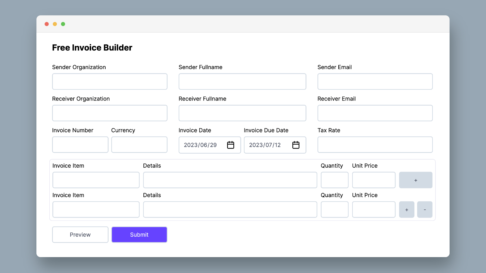

## Free Invoice Builder (Work in progress)

A free invoice builder hand-crafted by me with Deno/Node.js, vanilla JavaScript (Web Components).

Only supports `USD` currency format at the moment.



### Motivation

1. Mainly building it for my personal use
2. A project to play with Web Components
3. A project to practive native Node.js test runner
4. JavaScript Object Oriented Programming

### Usage

1. Clone the repo
```bash
git clone https://github.com/heybran/freeinvoicebuilder.git
```
2. Install dependencies
```bash
npm install
```
3. Run dev server
```bash
node nodeServer.js

# If you use deno
# deno run -A denoServer.js
```
